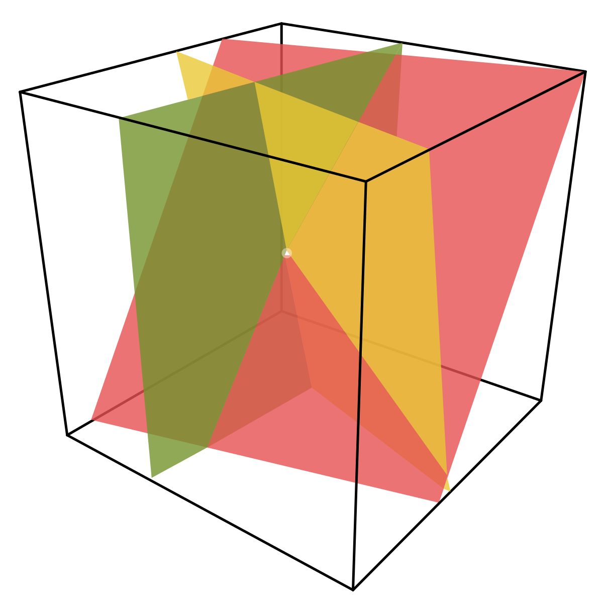

# Week 1: Systems of Linear Equations

Matrices are commonly used in machine learning and data science to represent data and its transformations. In this week, you will learn how matrices naturally arise from systems of equations and how certain matrix properties can be thought of in terms of operations on a system of equations.

## Labs

- [Intro to NumPy Arrays](notebooks/lab1_intro_numpy_arrays.ipynb)
- [Solving Linear Systems: Two Variables](notebooks/lab2_solving_linear_systems_2vars.ipynb)

## Learning Objectives

- Form and graphically interpret 2x2 and 3x3 systems of linear equations
- Determine the number of solutions to a 2x2 and 3x3 system of linear equations
- Distinguish between singular and non-singular systems of equations
- Determine the singularity of 2x2 and 3x3 system of equations by calculating the determinant

## Keynote

- [Week 1 Slides](./slides/Week1-Linear-Algebra-Keynote.pdf)
