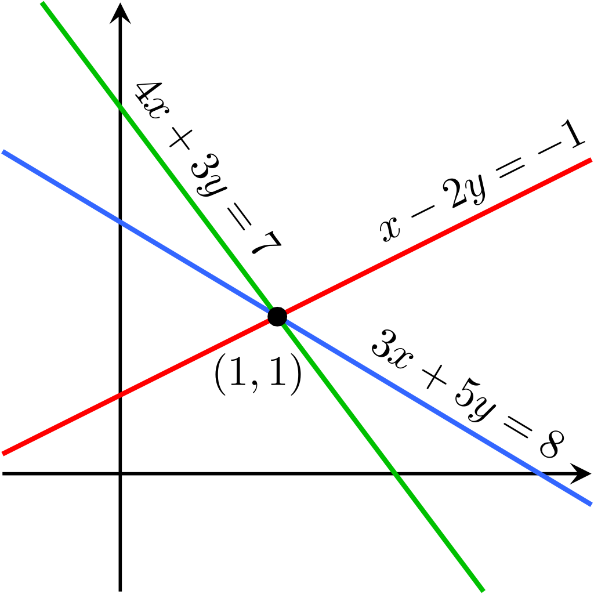

# Week 2: Solving Systems of Linear Equations

In this week, you will learn how to solve a system of linear equations using the elimination method and row echelon form. You will also learn about an important property of a matrix: the rank. The concept of the rank of a matrix is useful in computer vision for compressing images.

## Labs
- [Solving Linear Systems: 3 variables](./notebooks/lab1_w2_solving_linear_systems_3vars.ipynb)
- [Programming Assignment](./notebooks/lab2_w2_assignment.ipynb)
- [Programming Assignment: Solution](./notebooks/solution/lab2_w2_assignment_solved.ipynb)

## Learning Objectives

- Solve a system of linear equations using the elimination method
- Use a matrix to represent a system of linear equations and solve it using matrix row reduction
- Solve a system of linear equations by calculating the matrix in the row echelon form
- Calculate the rank of a system of linear equations and use the rank to determine the number of solutions to the system

## Keynote

- [Week 2 Slides](./slides/Week2-Linear-Algebra-Keynote.pdf)
